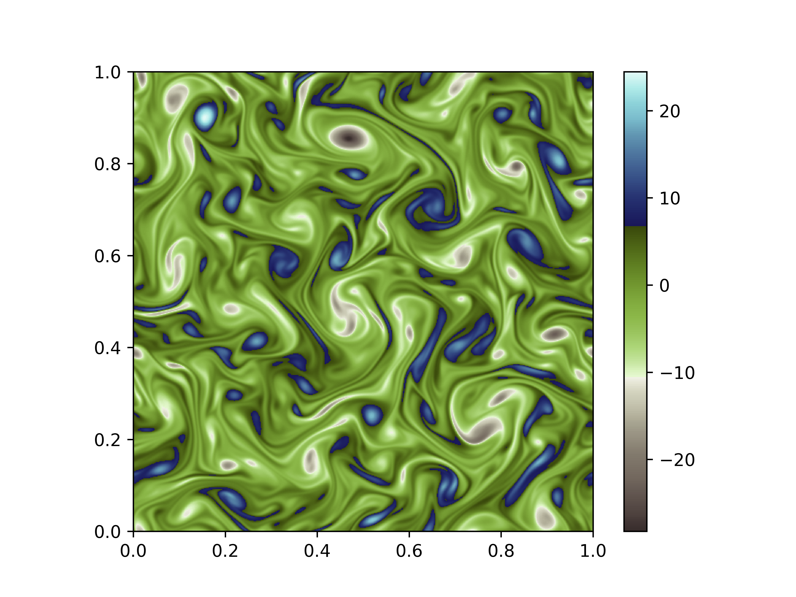
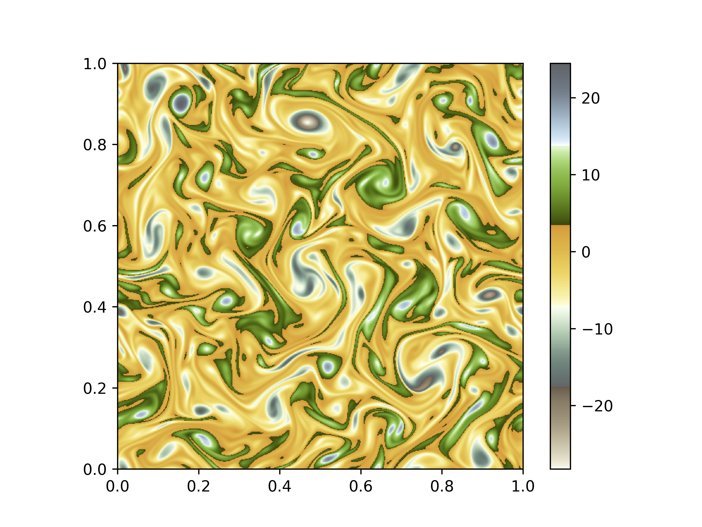
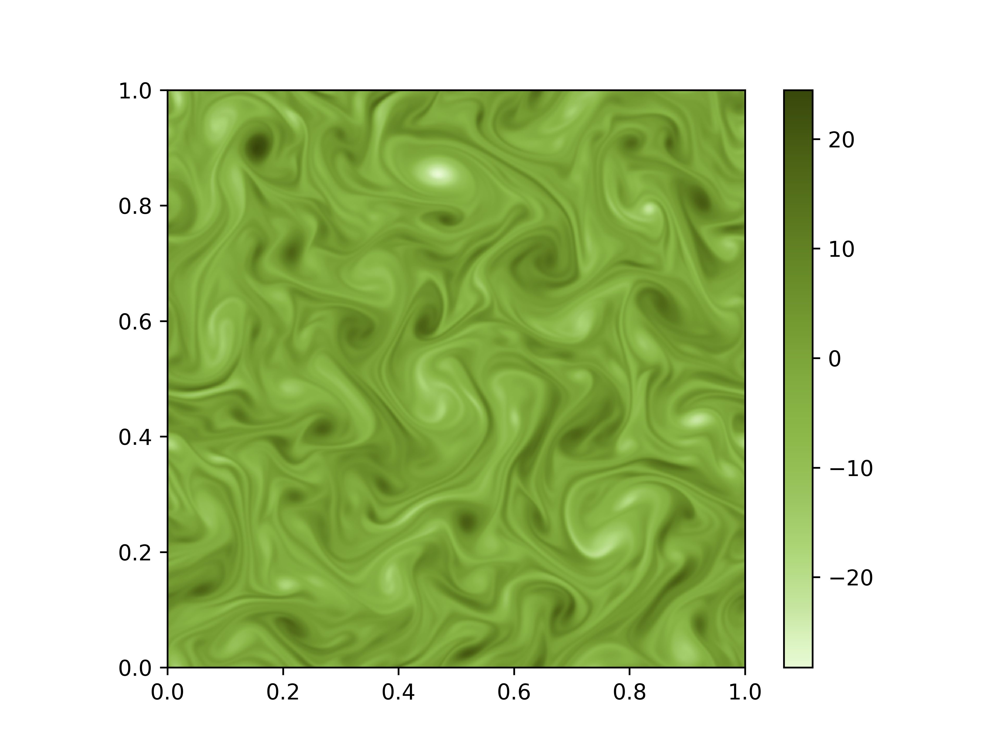
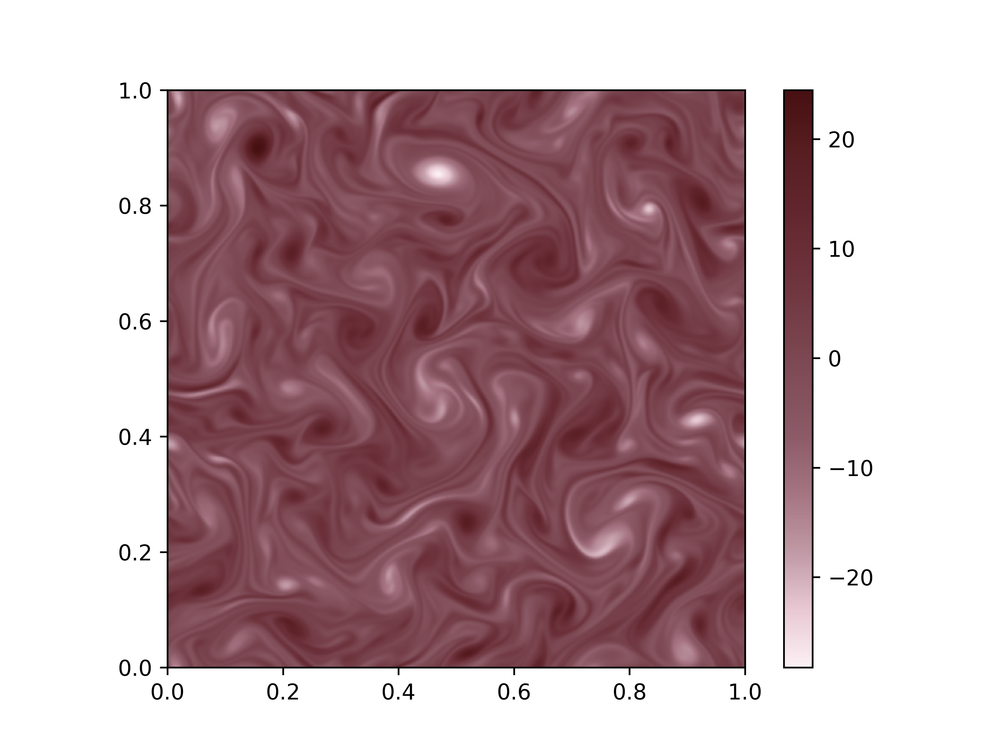

# SciVisColormaps

Repo holding some custom colormaps and a python script to convert them from `.xml` to matplotlib colormaps.

Here is a list of all colormaps:

yellow-1

colormap_2

yellow-2

3w_gby

yellow-3

yellow-7

4-wave-yellow-green-teal-gray

5wave-yellow-brown-blue

green-3

blue-9

3w_gGB

5w_BRgpb

blue-8

green-2

4w_ROTB

purple-6

3-wave-muted

purple-7

green-1

green-5

brown-9

5-wave-yellow-green

brown-8

orange-6

green-4

green-6

orange-4

orange-5

green-7

brown-6

brown-7

maroon-5

blue-1

blue-3

brown-5

